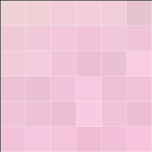
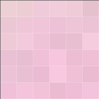

# Stegosaurus
Steganography Application for Encoding/Decoding Hidden Data in Images

## What is Steganography?
Steganography is the act of hiding something (like a secret message) inside of another thing that is itself not hidden. This practice dates back to Ancient Greece, possibly earlier. And since then it has been used in various forms. In modern times, computers have made Steganography relatively easy and accessible to the average user.

## How Does Digital Steganography Work?

Pixels in an image are made up of 3 values, (red, green, blue), that range from 0 to 255. The difference between, say, 233 and 234 is barely noticeable, especially to the human eye. As an example, The image on the right has had the RGB values of each of its pixels subtracted by 1. How different do they look?

<p align="center">


</p>

Now imagine these 36 pixels within an image containing over 65,000 pixels and zoomed out by 3200%
<p align="center">

</p>


This can be used to represent the 1s and 0s of a secret message encoded in ASCII binary without showing the actual 1s and 0s.

Given a set of 3 pixels = (27, 64, 164), (248, 244, 194), (174, 246, 250)
- The first 8 values will represent the 8 bits of a byte.
  - Even numbers are used to represent a 0
  - Odd numbers are used to represent a 1
- The 9th value will indicate if the next set of 3 pixels has a hidden byte or not
  - Even number indicates the next set of pixels is hiding a byte
  - Odd number indicates the current set of pixels is the last one hiding a byte

### Example
'Hello World' in ASCII Binary Representation is:
- "72", "101", "108", "108", "111", "32", "87", "111", "114", "108", "100"
- 01001000 01100101 01101100 01101100 01101111 00100000 01010111 01101111 01110010 01101100 01100100

11 Bytes x 3 Pixels/byte = 33 Pixels needed to encode the entire message
- The image used to encode this set of bytes must contain at least 33 pixels.

Given a 6x6 Pixel Image
- Original RGB Values
  ```
  (239,210,215)(240,207,214)(242,204,219)|(244,206,221)(241,205,217)(231,195,207)
  (237,201,213)(241,200,218)(243,198,219)|(240,195,216)(241,198,217)(239,196,215)
  (240,204,216)(245,204,222)(243,198,219)|(235,190,211)(235,192,211)(248,205,224)
  (237,194,214)(235,192,212)(242,194,218)|(248,200,224)(239,191,213)(241,193,215)
  (239,196,216)(236,193,213)(237,189,213)|(250,202,226)(242,194,216)(237,189,211)
  (242,194,218)(246,198,222)(245,196,218)|(238,189,211)(241,191,216)(246,196,221)
  ```
For each bit, left to right starting with the leftmost 0 of 'H', the associated RGB value (Again moving left to rigth for each line) will either remain the same (If it's already the correct value), or subtracted by 1 to make it Even/Odd, to match with the bit value.
- 'H' Starts with binary 0, so the first pixel value must be even.
  - 239 isn't even, so 1 is subtracted to make it 238.
- This repeats until reaching the 33rd pixel.
  - The last pixel value to represent the final bit of 'd' is 0, so the middle value in the pixel must be even.
  - 196 is even, so it's left alone.
- The last value of the 33 pixel must be odd, to indicate no further pixels are hiding a message
  - 218 isn't Odd, so 1 is subtracted to make it 217
- RGB Values After Hiding 'Hello World' in the Image
```
(238,209,214)(240,207,214)(242,204,218)|(244,205,221)(240,204,217)(230,195,206)
(237,201,213)(241,200,218)(243,198,219)|(240,195,216)(241,198,217)(239,196,215)
(240,204,216)(245,204,222)(243,198,219)|(235,190,211)(235,192,211)(248,205,224)
(237,194,214)(235,192,212)(242,194,218)|(248,200,224)(239,191,213)(241,193,215)
(239,196,216)(236,193,213)(237,189,213)|(250,202,226)(242,194,216)(237,189,211)
(242,194,218)(246,198,222)(245,196,218)|(238,189,211)(241,191,216)(246,196,221)
```

## Running the Application
