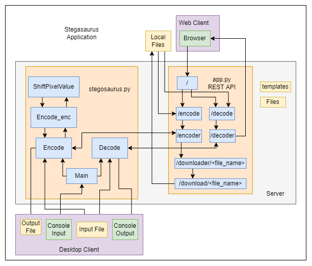

# Stegosaurus
Steganography Application for Encoding/Decoding Hidden Data in Images

## What is Steganography?
Steganography is the act of hiding something (like a secret message) inside of another thing that is itself not hidden. This practice dates back to Ancient Greece, possibly earlier. And since then it has been used in various forms. In modern times, computers have made Steganography relatively easy and accessible to the average user.

### How Does Simple Digital Steganography Work?

Pixels in an image are made up of 3 values, (red, green, blue), that range from 0 to 255. The difference between, say, 233 and 234 is barely noticeable, especially to the human eye. As an example, the image on the right has had the RGB values of each of its pixels subtracted by 1. How different do they look?

<p align="center">


</p>

Now imagine trying to see the difference when these 36 pixels are within an image containing over 65,000 pixels and zoomed out by 3200%
<p align="center">

</p>

This barely noticeable shift in pixel values can be used to represent the 1s and 0s of a secret message encoded in ASCII binary without showing the actual 1s and 0s.

Given a set of 3 pixels = (27, 64, 164), (248, 244, 194), (174, 246, 250)
- The first 8 values will represent the 8 bits of a byte.
  - Even numbers are used to represent a 0
  - Odd numbers are used to represent a 1
- The 9th value will indicate if the next set of 3 pixels has a hidden byte or not
  - Even number indicates the next set of pixels is hiding a byte
  - Odd number indicates the current set of pixels is the last one hiding a byte

### Example
'Hello World' in ASCII Binary Representation is:
- "72", "101", "108", "108", "111", "32", "87", "111", "114", "108", "100"
- 01001000 01100101 01101100 01101100 01101111 00100000 01010111 01101111 01110010 01101100 01100100

11 Bytes x 3 Pixels/byte = 33 Pixels needed to encode the entire message
- The image used to encode this set of bytes must contain at least 33 pixels.

Given a 6x6 Pixel Image
- Original RGB Values
  ```
  (239,210,215)(240,207,214)(242,204,219)(244,206,221)(241,205,217)(231,195,207)
  (237,201,213)(241,200,218)(243,198,219)(240,195,216)(241,198,217)(239,196,215)
  (240,204,216)(245,204,222)(243,198,219)(235,190,211)(235,192,211)(248,205,224)
  (237,194,214)(235,192,212)(242,194,218)(248,200,224)(239,191,213)(241,193,215)
  (239,196,216)(236,193,213)(237,189,213)(250,202,226)(242,194,216)(237,189,211)
  (242,194,218)(246,198,222)(245,196,218)(238,189,211)(241,191,216)(246,196,221)
  ```
For each bit, left to right starting with the leftmost 0 of 'H', the associated RGB value (Again moving left to rigth for each line) will either remain the same (If it's already the correct value), or subtracted by 1 to make it Even/Odd, to match with the bit value.
- 'H' Starts with binary 0, so the first pixel value must be even.
  - 239 isn't even, so 1 is subtracted to make it 238.
- This repeats until reaching the 33rd pixel.
  - The last pixel value to represent the final bit of 'd' is 0, so the middle value in the pixel must be even.
  - 196 is even, so it's left alone.
- The last value of the 33 pixel must be odd, to indicate no further pixels are hiding a message
  - 218 isn't Odd, so 1 is subtracted to make it 217
- RGB Values After Hiding 'Hello World' in the Image
  ```
  (238,209,214)(240,207,214)(242,204,218)(244,205,221)(240,204,217)(230,195,206)
  (237,201,213)(241,200,218)(243,198,219)(240,195,216)(241,198,217)(239,196,215)
  (240,204,216)(245,204,222)(243,198,219)(235,190,211)(235,192,211)(248,205,224)
  (237,194,214)(235,192,212)(242,194,218)(248,200,224)(239,191,213)(241,193,215)
  (239,196,216)(236,193,213)(237,189,213)(250,202,226)(242,194,216)(237,189,211)
  (242,194,218)(246,198,222)(245,196,218)(238,189,211)(241,191,216)(246,196,221)
  ```

In this case, decoding the message is as simple as looking at the least significant bit of the values of each set of 3 pixels and converting the resulting binary to human readable ASCII

### Benefit of Using Web-Based Steganography Tools
Steganography is generally very hard to detect, especially if the person is not aware Steganography has been used, as an image hiding a message effectively looks the same as the original image, with no visible loss in the picture quality. Often, the simplest way Steganography is detected is by the existence of a Steganography tool on the system. Using a Web-Based tool eliminates this risk, assuming the tool isn't bookmarked on your web browser, further reducing the likelihood of a hidden message being detected and decoded.

## The Application
Stegosaurus can be used either as a local console application, or as a Web App.
- The Web App is implemented using the Flask Framework
  - Aside from the Stegosaurus Specific Content on each page, all HTML styling is based on W3Schools' [Interior Design Template](https://www.w3schools.com/w3css/tryw3css_templates_interior_design.htm)
- The local console application is a simple Python script

Below is a simplified Software Architecture diagramming how the application behaves. Depending on whether a client is accessing the application over a local console or via a web browser, some features act differently, or are skipped entirely.

<p align="center">

</p>

### API Documentation

#### Encoding: Hiding a message inside an Image
**POST** `/encoder`
	*file (formData)*
	*message (formData)*

  ```html
  <form action = "http://localhost:5000/encoder" method = "POST"
   enctype = "multipart/form-data">
   <input type = "file" name = "file" /><br><br>
   <label for = "message">Message:</label><br>
   <input type = "text" id = "message" name = "message"/><br><br>
   <input type = "submit" value="Encode Image"/>
   </form>
  ```

#### Decoding: Revealing a message inside an Image

**POST** `/decoder`
  *file (formData)*

  ```html
  <form action = "http://localhost:5000/decoder" method = "POST"
     enctype = "multipart/form-data">
     <input type = "file" name = "file" /><br><br>
     <input type = "submit" value="Decode Image"/>
  </form>
  ```

#### Downloading: Retrieving Files from Server

**GET** `/download/<file_name>``

### Running the Application
*Important: This app has only been tested with Python3, it may not work with Python2*

*Note: Because JPEG uses lossy compression algorithm, some data may be lost, which results in inconsistent encode output. Due to this, all input JPEG images will be output as PNG files, to preserve the fine adjustments implemented in the encoding process*

##### Currently Supported Image File Types:
  * **JPG/JPEG**: File must end in *.jpeg* extension
  * **PNG**

#### Desktop Client
To run Stegosaurus locally on your desktop as a Console Application, do the following:

1. Clone the github repo to a local directory
2. Place the image you want to use for the application in the *Stegosaurus/Images* directory
3. From a console/terminal window, navigate to the main *Stegosaurus* directory
4. Run the application
  ```
  python stegosaurus.py
  ```
5. To hide a message in an image, select 1 for Encode. To reveal a hidden message, select 2 for Decode.
  * If you chose Encode, you will be prompted for the image file name and the message to hide in it.
    * The encoded file will be output to the *Stegosaurus/output_files/* directory as a file named *encoded_out.png*
  * If you chose Decode, you will be prompted for the image file name to reveal the message from.
    * The hidden message will be output to the console window.

#### Web Client
To run Stegosaurus as a Web App, and then access it via a Browser, do the following:

1. Clone the github repo to the webserver
2. From a local console on the server, navigate to that directory
3. Run the web application
  ```
  python app.py
  ```
4. From a browser, navigate to the home page
5. To hide a message in an image, select Encode from the Sidebar. To reveal a hidden message, select Decode from the Sidebar

  For Encoding
  1. Click on **Choose File** to select and upload an image to hide a message within
  2. Enter the message to hide in the text box, then click **Encode Image**
  3. You will be redirected to a page where you can now download your encoded image by clicking on the **Download Encoded File** Link.

  For Decoding
  1. Click on **Choose File** to select and upload an image to reveal a hidden message from, then click **Decode Image**
  2. You will be redirected to a page where your hidden message has been revealed.

To close the application, from the server console simply enter **Ctrl+c**
